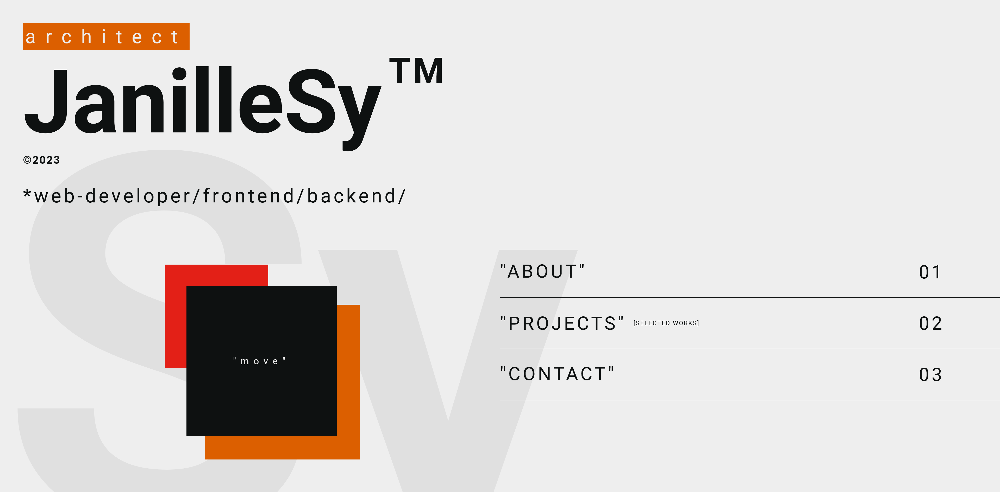
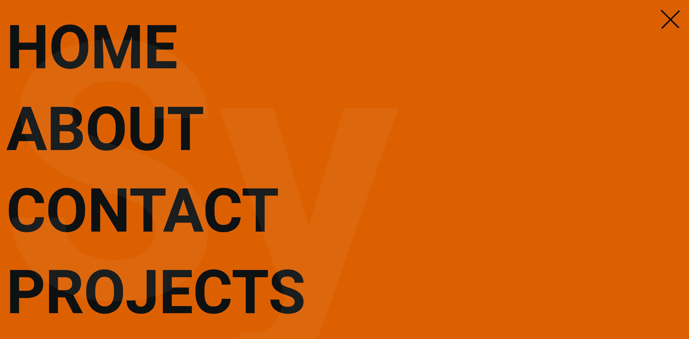
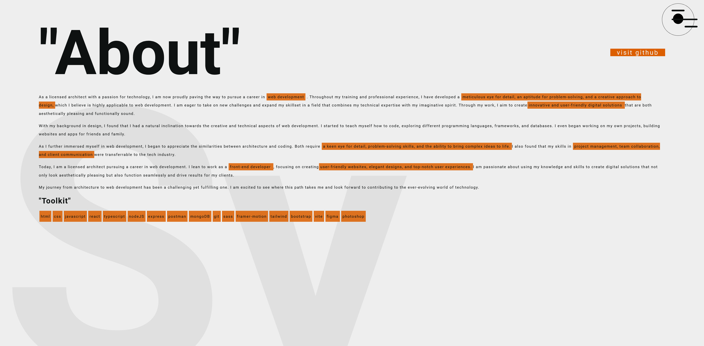
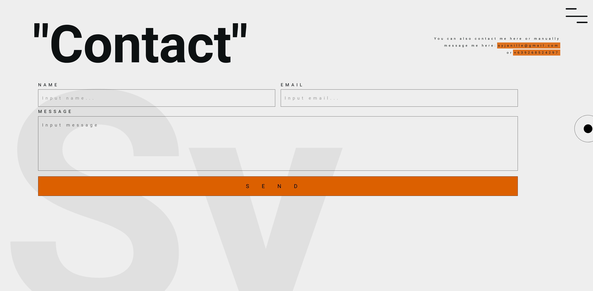
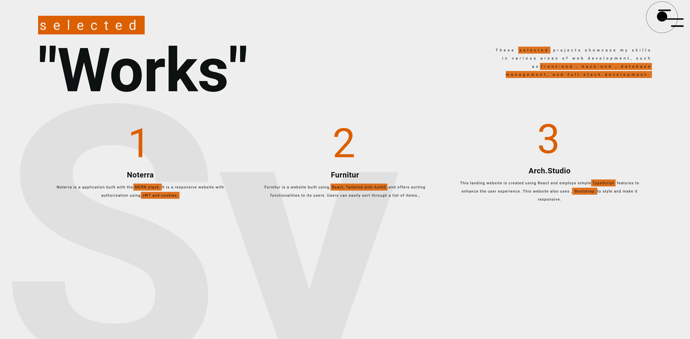
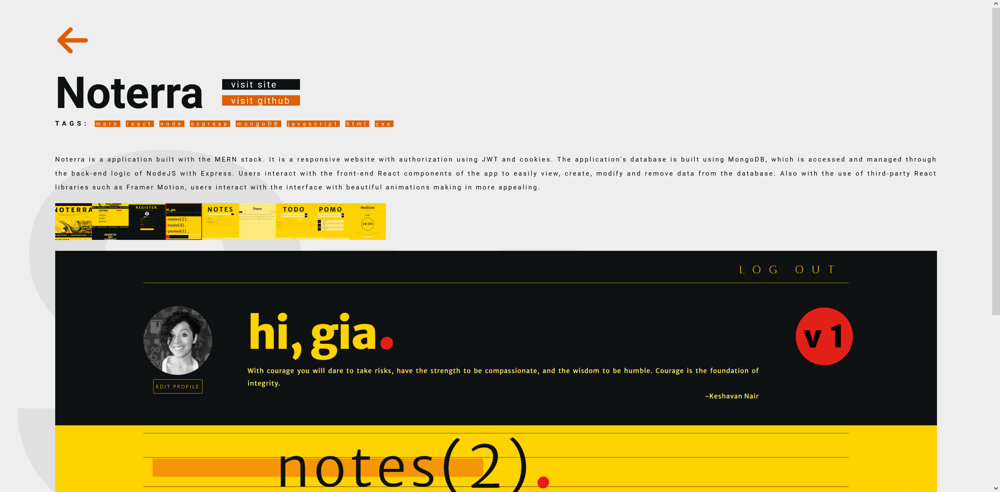

# JanilleSy

> The portfolio website is a clean and modern design, displaying the developer's skills and past experiences in a visually appealing way.
>
> Live demo [_here_](https://janillesy.netlify.app/).

## Table of Contents

- [JanilleSy](#janillesy)
  - [Table of Contents](#table-of-contents)
  - [General Information](#general-information)
  - [Technologies Used](#technologies-used)
  - [Features](#features)
  - [Screenshots](#screenshots)
  - [Contact](#contact)

## General Information

The portfolio website is a clean and modern design, displaying the developer's skills and past experiences in a visually appealing way. The use of React allows for a fast and responsive user interface, with sleek transitions and animations.

Overall, the portfolio website effectively showcases the developer's skills and experiences in a clean and modern design, with the use of React allowing for a fast and responsive user experience.

## Technologies Used

- React
- CSS

## Features

- Responsive website layout across multiple devices
- Page animations
- Interactive component animations
- Image Gallery
- Contact form

## Screenshots

## Contact

> Created by Janille Sy - feel free to contact me!
>
> EMAIL - syjanille@gmail.com
>
> MOBILE - 09268524297
